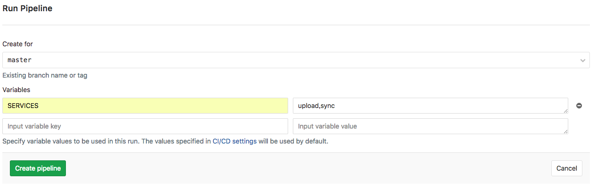

# 如何使用gitlab-ci
---

> [基于Gitlab CI搭建持续集成环境](https://www.jianshu.com/p/705428ca1410)
> [gitlab-ci官方文档](https://docs.gitlab.com/runner/)

### GitLab CI介绍
GitLab CI是 GitLab 提供的持续集成服务，只要在你的仓库根目录 创建一个.gitlab-ci.yml 文件， 并为该项目指派一个Runner，当有合并请求或者 push的时候就会触发build。

这个.gitlab-ci.yml 文件定义GitLab runner要做哪些操作。 默认有3个stages: build、test、deploy。

### 配置Runner

1. 添加Gitlab的官方源
`curl -L https://packages.gitlab.com/install/repositories/runner/gitlab-ci-multi-runner/script.deb.sh | sudo bash`

2. 安装
`sudo apt-get install gitlab-ci-multi-runner`

3. 注册Runner
Runner需要注册到Gitlab才可以被项目所使用，一个gitlab-ci-multi-runner服务可以注册多个Runner
    ```shell
    $ sudo gitlab-ci-multi-runner register

    Please enter the gitlab-ci coordinator URL (e.g. https://gitlab.com )
    https://mygitlab.com/ci  
    Please enter the gitlab-ci token for this runner
    xxx-xxx-xxx   
    Please enter the gitlab-ci description for this runner
    my-runner
    INFO[0034] fcf5c619 Registering runner... succeeded
    Please enter the executor: shell, docker, docker-ssh, ssh?
    docker
    Please enter the Docker image (eg. ruby:2.1):
    node:4.5.0
    INFO[0037] Runner registered successfully. Feel free to start it, but if it's
    running already the config should be automatically reloaded!
    ```
    * 第一、二项是CI／CD设置中url和token

    * 第三项为该runner的描述

    * 第四项该runner的tag，tag主要用在运行时可指定runner

    * 第五项是选择执行模式，我们项目现在是有两个runner，一个是shell模式一个是docker模式。docker模式用来进行build操作，目的是防止多个build同时执行时都在自己的环境中代码不会互相覆盖；shell模式用来执行部署操作，直接对我们的测试服务器进行部署

4. Runner高级配置
通过gitlab-ci-multi-runner register注册的Runner配置会存储在/etc/gitlab-runner/config.toml中，如果需要修改可直接编辑该文件
    ```shell
    concurrent = 1
    check_interval = 0

    [[runners]]
    name = "im-test"
    url = "https://gitlab.qukuaishequ.com/"
    token = "bfa13d79799ddf5adb14b88baeec2d"
    executor = "docker"
    [runners.docker]
        tls_verify = false
        image = "ubuntu:16.04"
        privileged = false
        disable_cache = false
        volumes = ["/cache", "/home/game/cache:/tmp:rw"]
        shm_size = 0
    [runners.cache]

    [[runners]]
    name = "im-deploy"
    url = "https://gitlab.qukuaishequ.com/"
    token = "ec98952e25872d60880a156fdda015"
    executor = "shell"
    [runners.cache]
    ```

### 配置构建任务
具体用法参考[官方文档](https://docs.gitlab.com/ce/ci/yaml/README.html)
```yml
image: wjj5699121/ci-docker:1.0

before_script:
- export GO111MODULE=on

stages:
- build
- deploy

service-build:
  stage: build
  script:
  - cd $PWD/tools/build
  - chmod 777 dev_build.sh
  - ./dev_build.sh $SERVICES
  tags:
  - runner1

service-deploy:
  stage: deploy
  script:
  - cd $PWD/tools/build
  - chmod 777 dev_run.sh
  - ./dev_run.sh $SERVICES $SERVICE_SECRET
  environment:
    name: dev1
    url:
  only:
  - master
  tags:
  - deploy
```
参数介绍：
* image:用于docker镜像，查看docker文档

* stages:定义构建阶段

* before_script:定义在每个job之前运行的命令

* script: 每个job需要执行的command

* tags：指定那个runner来执行

* environment： deployment的环境配置

* only：指定分支触发执行该stage

docker镜像使用的是自己构建的，主要将项目中的mod中的包放进去，防止在每次build时都要进行下载。

现阶段当一个分支被提交上来后只会触发执行service-build，检查项目是否编译通过。后期会加上代码质量检查和go test测试。

只有master分支才会触发service-deploy。所以如果需要进行测试服务器的部署，步骤就是：

* 在CI/CD页面点击Run Pipeline

* 选择master分支

* 在 Variables填写信息，variable key填写`SERVICES` ;variable value填写需要部署的微服务名称，多个服务用，分割（如upload,sync,session）

* 点击create pipeline 

* 在跳转的页面查看具体部署情况


### 后期部署设想
* 对于prod环境其实也可以使用runner实现，原理一样。代码分支可能需要改动，分为master，dev，other。master用来部署prod环境，dev部署测试环境。
* 现阶段服务管理使用的supervisor，后期可以使用docker，相关命令用法都是一样，docker设计理念就是每个docker只有一个进程运行，结合docker-compose和docker swarm实现多服务器集群部署，可以实现实例动态增加，零宕机，滚动部署等（docker swarm需要学习）。
* 最终实现gitlab+docker+docker swarm部署模式。