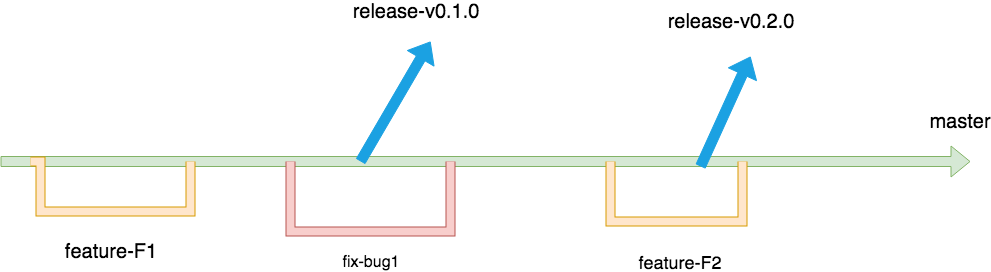

## git 工作流规范





### 1.master 分支（受保护）  
master分支是保护分支，其上的每一个提交的代码都是可运行的代码，只有维护者有合入权限。

### 2.功能需求和bugfix分支（临时分支，合入master后，删除）  
1）功能需求分支命名规范： feature-***  
功能分支可以划分得细一点，是一个最小可以完整交付和测试的特性，比如登录：feature-login  
2）bug修复分支命名规范：fix-***  
比如修复etcd CPU 100%的问题：fix-etcd-cpu-100%  
备注：功能分支测试完成后，给master分支的维护者发一个merge request，然后进行代码review通过以后  
合入master分支，然后被删除。  

### 3.迭代发布版本的分支（受保护）  
用于发布迭代的版本，在master分支来出来，该分支只包含该迭代包含的需求和bugfix  
命名规范：release-***  
比如迭代一结束后拉出的分支: release-v0.1.0  

比如实现一个需求F1的流程（bug fix 流程类似）：  
1）更新master到最新版本，然后从master拉出 feature-F1 分支  
```
git checkout master # 切换到master分支
git pull # 拉取master分支最新代码
git checkout -b feature-F1 # 拉出feature-F1并切换过去
```
2）在 feature-F1 分支上开发功能并测试  
3）把 feature-F1 push 到服务器上，然后发起 把服务器上的feature-F1 合入 master 的 merge request（MR)
```
git push -u feature-F1 origin/feature-F1
```  
4）代码reveiw  
5）master的维护者接收 MR 把 feature-F1 合入 master，并删除 feature-F1 